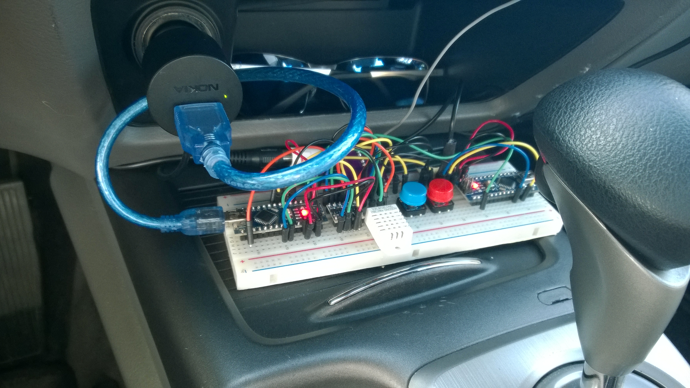
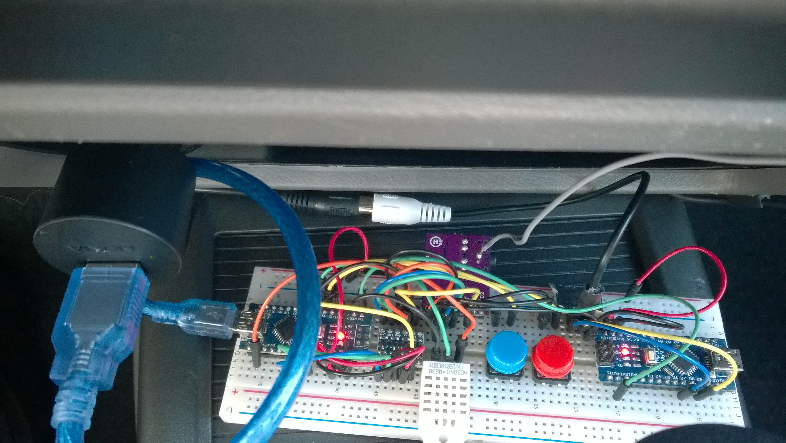
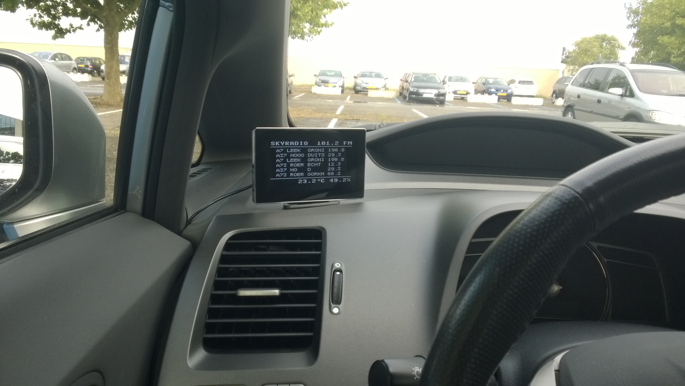
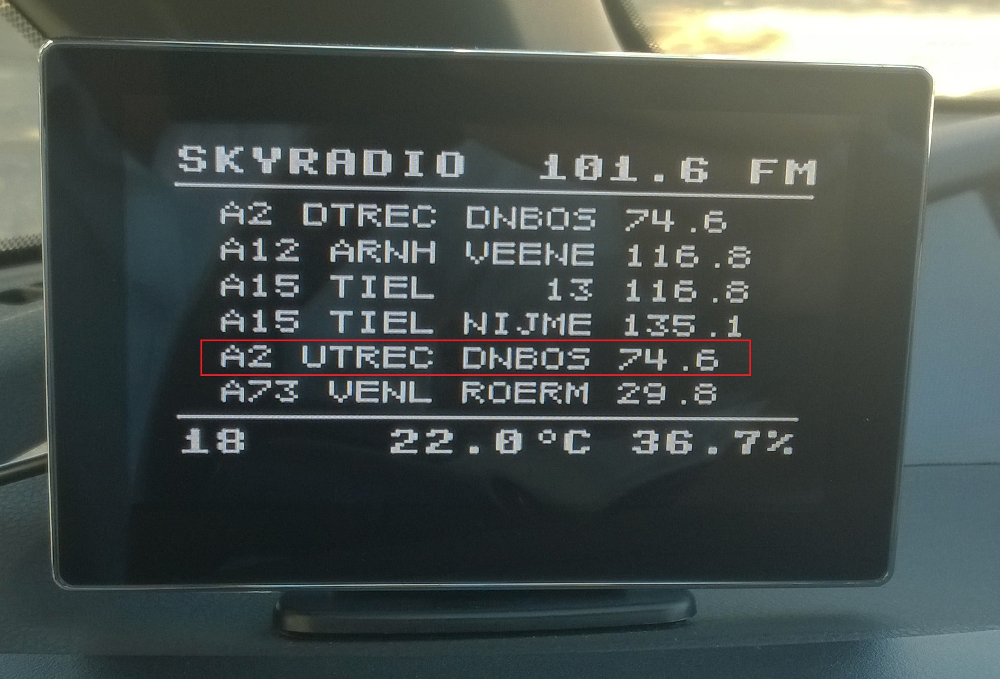

# Speed Camera Location

This project consists of two Arduino programs.

- si4703-fm-rds-receiver: This program parses RDS data received via an SI4703 FM radio chip and sends it out over serial port.
- tv-out: This program receives serial data from the other microcontroller and displays it over the TFT monitor using the TV-out library.

## Prototype

## Demo

